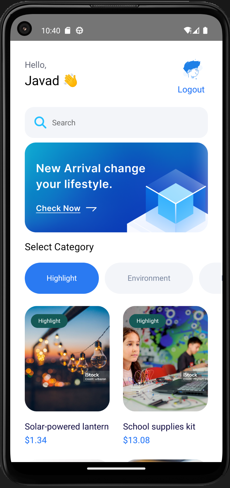
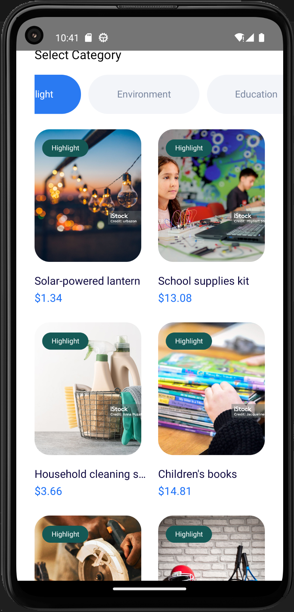
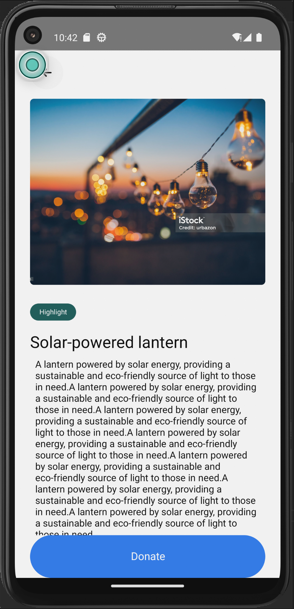
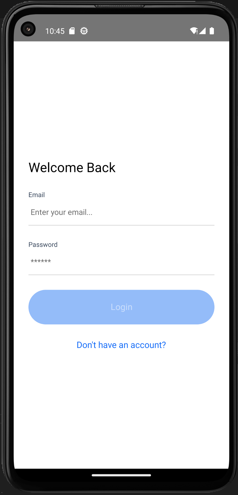
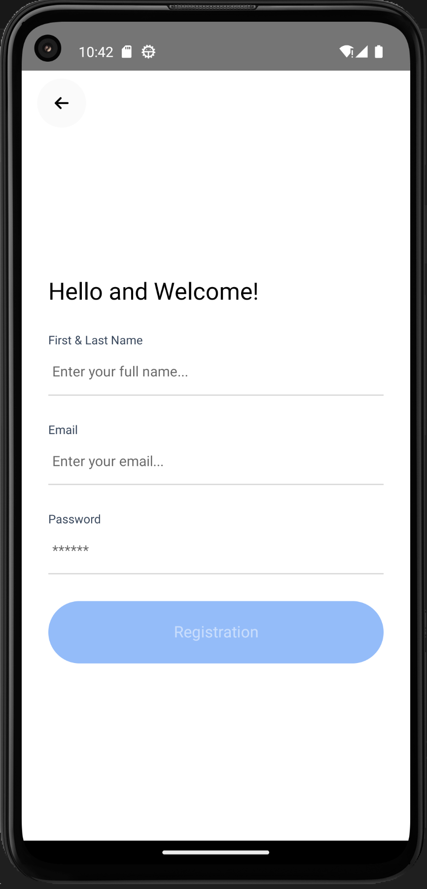

📱 React Native Simple Donation App


This is a **simple and modern** Android application built with **React Native CLI**. It provides user authentication via **Firebase**, infinite scrolling for seamless content browsing, and a structured navigation system. The app consists of a **login page, sign-up page, home page, and donation page**. It also utilizes **Redux** for state management, ensuring a scalable and maintainable architecture.

---

<p align="center">
  
  
  
  
  
</p>

## 🚀 How to Run the Project

### 📌 Prerequisites
Before running the project, ensure you have the following installed on your system:
- **Node.js** (Recommended version: LTS)
- **Yarn or npm**
- **Android Studio** (for Android emulation)
- **React Native CLI** (if needed)

### 🛠 Install Dependencies
To install the required packages, run the following command in the root directory:

```sh
npm install
# or if using Yarn:
yarn install
```

### ▶️ Run the Application
To run the project on an Android emulator or physical device, use:

```sh
npx react-native run-android
```

If you need to start Metro Bundler manually:
```sh
npx react-native start
```

---

## 📦 Project Dependencies
The following libraries are used in this project:

```json
"@fortawesome/fontawesome-svg-core": "^6.7.2",
"@fortawesome/free-brands-svg-icons": "^6.7.2",
"@fortawesome/free-regular-svg-icons": "^6.7.2",
"@fortawesome/free-solid-svg-icons": "^6.7.2",
"@fortawesome/react-native-fontawesome": "^0.3.2",
"@react-native-async-storage/async-storage": "^2.1.0",
"@react-native-firebase/app": "^21.10.0",
"@react-native-firebase/auth": "^21.10.0",
"@react-native-masked-view/masked-view": "^0.3.2",
"@react-navigation/native": "^7.0.14",
"@react-navigation/stack": "^7.1.1",
"@reduxjs/toolkit": "^2.5.1",
"prop-types": "^15.8.1",
"react": "18.3.1",
"react-native": "0.77.0",
"react-native-device-info": "^14.0.2",
"react-native-fast-image": "^8.6.3",
"react-native-gesture-handler": "^2.22.1",
"react-native-reanimated": "^3.16.7",
"react-native-safe-area-context": "^5.1.0",
"react-native-screens": "^4.5.0",
"react-native-svg": "^15.11.1",
"react-redux": "^9.2.0",
"redux": "^5.0.1",
"redux-logger": "^3.0.6",
"redux-persist": "^6.0.0"
```

---

## 📞 Contact Us
- **E-Mail:** abbasi.sheldarreh@gmail.com
- **LinkedIn:** [Javad Abbasi Sheldarrei](https://www.linkedin.com/in/javad-abbasi-sheldarrei/)
